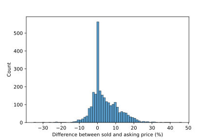
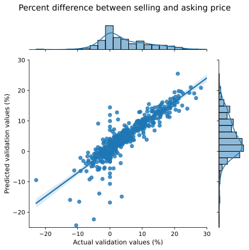
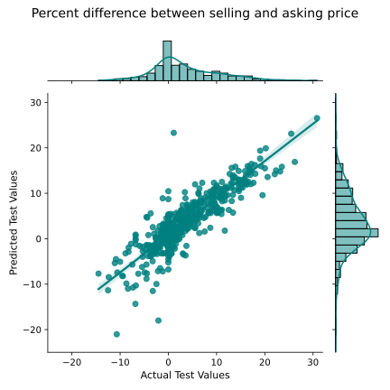
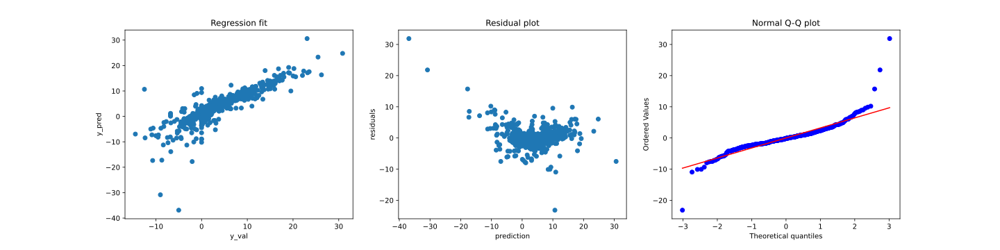

# Winning bids on homes recently sold in PDX
Emily Lorenzen
05/14/2021

## Abstract
Most homes on the market in Portland have sold for more than the listing price over the past year. To assist homebuyers I developed a linear regression model to predict the percent difference between sold price and listing price. Data was obtained from redfin, a website that stores information on sold and listing prices as well and dozens of other details about sold homes. I refined the linear regression model by transforming data, adding polynomial features, and creating dummy variables for categorical data. The final model was able to predict the % difference between the winning bid and listed price with a mean average error of 2.25%. 

## Data
The data for this project was scraped from the website https://www.redfin.com. To focus on the recent "hot" market in Portland, I scraped data on sales of Portland homes from only the past three months. I retrieved the following features for each home - street, zipcode, street, state, sold price, listed price, changed price (if applicable), listed date, changed price date (if applicable), home size, price per square foot, lot size, beds, baths, property type, number of website views, number of favorites on redfin, and walk score. 

## Tools and Algorithms

#### Web Scraping
Selenium was used as a webdriver to navigate the webpages of Redfin and get htmls. BeautifulSoup parsed the scraped htmls, allowing navigation of the html to retrieve information of interest. Retrieved information was then was structured into a dictionary. 

#### Data cleaning and feature engineering
Dictionaries created from webscraping were converted into a pandas dataframe and the data was cleaned to remove duplicates, and rows that didn't contain required information for target feature calculation. Following data cleaning, there were a total of 2519 unique units of data. 

The value I want to predict is percent difference between sold price and listing price. Thus, the target value was calculated by determining (sold price - listing price)/listing price. In the case that the price changed after the initial listing, the target value was calculated by (sold price - changed price)/changed price. 

Several different methods were used to engineer features. These methods include log transformation, polynomial and creation of dummy features. 

#### Linear regression modeling and evaluation
Linear regression fitting was performed by SciKit-Learn. Linear regression models were evaluted by SciKit-Learn and StatsModel. 

#### Data visualization
Seaborn and matplotlib were used for data visualization. 

## Results/Design
I first examined the distribution of my target variable (the percent difference betwen selling and listing price) to ensure that the data reflects reports indicating that Portland homes are selling for more than listing price (Fig 1). 

To develop a linear regression model, I set aside 20% of the data as a test set. I then split the remaining 80% of the data into a training set (60% of all data) and validation set (20% of all data). I also cross-validate R^2 with a fold of 5. A variety of feature engineering methods were iteratively used, with the aim of maximizing R^2 on the validation data. The final model was chosen because it had a high R^2 on both training and validation data, and a similar mean cross-validated R^2 with small standard error (0.709 +- 0.068). See table 1 for the model evaluation metrics for the training and evalution data. 

I then retrained the linear regression model using the feature engineering used above and on the training and data set. Finally, I benchmarked the resulting model against the test data set. See Table 1 for model evaluation metrics. The cross-validated R^2 was 0.732 +- 0.056.

Table 1:

| Metric | Train | Evaluate | Model | Test  |
|--------|-------|----------|-------|-------|
| R^2    | 0.784 | 0.782    | 0.788 | 0.732 |
| RMSE   | 3.52% | 3.53%    | 3.50% | 3.52% |
| MAE    | 2.36% | 2.37%    | 2.13% | 2.25% |

*Although another method of feature engineering produced an R^2 higher, the cross-validated R^2 was negative with a much higher standard error. 

Finally, I examined the distribution of residuals to inform additional feature engineering. It's clear that the model has poor predictive power for low target values and y prediction and resulting residuals have a quadratic relationship. 

In addition, I plan to improve on this model by using lasso regularization to reduce overfitting. 

## Communication
Results were presented on May 14, 2021 to colleagues in the Metis data science bootcamp. Code is available on my github. 

## Acknowledgements
Data was provided, albeit unwillingly, by redfin.com. Leon Johnson and Rita Biagioli provided project feedback, suggestions in feature engineering and help in data interpretation. Lew facilitated a successful webscraping by suggesting additional methods to trick redfin. Valentina Rizzati, Heather Gardner and Wenting Deng provided great laughs and sanity checks.  

