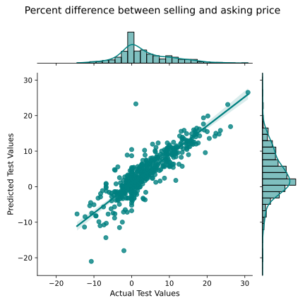

Regression module learning objectives:
- Gain proficiency in web scraping
- Apply linear regression to a real-world problem, including preprocessing steps, model evaluation, and regularization

# Predict winning bids on PDX homes

Predicted the amount a buyer needs to offer in order to win a bid on a home in Portland, OR by using linear regression. Scraped data from RedFin on homes sold in the Portland, OR area over the past three months. Engineered features and iteratively tested models. Best model performed with an mean absolute error of 2.5%. 

Figure: Predicted percentage difference between asking price and winning bids vs. actual percentage difference for homes bought in Portland, OR within the past three months. 

Tools used:
Selenium, BeautifulSoup, Pandas, Seaborn, Matplotlib

Data accessed:
Redfin

Future directions:
Create streamlit app and deploy with Heroku
